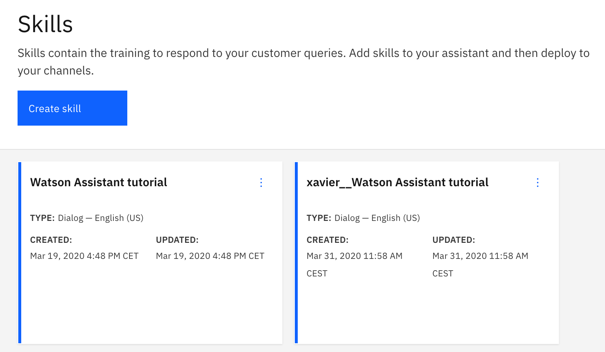

Initialise the project.  

```
$ git init
$ wa-cli init
...
The values you have supplied have been added to the .env file
You can set them as environment variables
and enable command completion by running

   set -o allexport; source .env; set +o allexport; eval "$(_WA_CLI_COMPLETE=source_bash wa-cli)"
$ set -o allexport; source .env; set +o allexport; eval "$(_WA_CLI_COMPLETE=source_bash wa-cli)"
$ touch README.md
$ git add .
$ git status
...
	new file:   .gitignore
	new file:   .wa-cli/main_branch.txt
	new file:   README.md
$ git commit -m "Initial commit"
```

Get a skill from a public repo and deploy it.

```
$ wget -P skills https://raw.githubusercontent.com/watson-developer-cloud/community/master/watson-assistant/complex_dialog_tutorial.json
$ wa-cli skills deploy skills/complex_dialog_tutorial.json
$ wa-cli skills list
...
2020-03-19T15:48:04.359Z   f8bc1ed2-7dfa-4f4e-b519-3203947703b1   Watson Assistant tutorial
```

Enable the use of sanboxes for that skill, and commit the decomposed skill.

```
$ wa-cli sandbox init "Watson Assistant tutorial"
$ git add .
$ git status
...
	new file:   waw/Watson Assistant tutorial/counterexamples/IRRELEVANT.csv
	new file:   waw/Watson Assistant tutorial/dialog/dialog.xml
	new file:   waw/Watson Assistant tutorial/entities/menu.csv
...
	new file:   waw/Watson Assistant tutorial/intents/Customer_Care_Appointments.csv
	new file:   waw/Watson Assistant tutorial/intents/Customer_Care_Authorized_User.csv
...
	new file:   waw/Watson Assistant tutorial/meta.json
$ git commit -m "Decomposed Watson Assistant tutorial"
```


Create a sandbox and work with it

```
$ git checkout -b xavier
Switched to a new branch 'xavier'
$ wa-cli sandbox push "Watson Assistant tutorial"
$ wa-cli skill list
  list_workspaces - {'X-RateLimit-Reset': '2020-03-31 10:11:37', 'X-RateLimit-Remaining': '493', 'X-RateLimit-Limit': '500'}
2020-03-19T15:48:04.359Z   f8bc1ed2-7dfa-4f4e-b519-3203947703b1   Watson Assistant tutorial
2020-03-31T09:58:40.019Z   726e531d-1f5b-4294-91a5-c83fcb80109c   xavier__Watson Assistant tutorial
```

Just for comparison purposes, we get the JSON file of our sandbox and track it in git

```
$ wa-cli sandbox pull "Watson Assistant tutorial"
$ git add .
$ git commit -m "Track the sandbox JSON just for comparison purposes"
```


In the Watson Assistant UI, there is now a new skill, named
`xavier__Watson Assistant tutorial`.




I started following [Tutorial: Adding a node with
slots to a dialog](https://cloud.ibm.com/docs/assistant?topic=assistant-tutorial-slots).
When it required to create a `#reservation` intent, rather than using the UI and adding
the intents example one by one, I created
`waw/Watson Assistant tutorial/intents/reservation.csv` and then executed again 
`wa-cli sandbox push "Watson Assistant tutorial"`. At any point while working
with the UI, I can create a snapshot by running `wa-cli sandbox pull`. I can restore
that snapshot with `wa-cli sandbox push`

```
$ wa-cli sandbox pull
$ git add .
$ git status
...
	modified:   waw/Watson Assistant tutorial/dialog/dialog.xml
	modified:   waw/Watson Assistant tutorial/entities/system_entities.csv
	new file:   waw/Watson Assistant tutorial/intents/reservation.csv
	modified:   waw/Watson Assistant tutorial/meta.json
$ git commit -m "Completed first slots tutorial"
```
